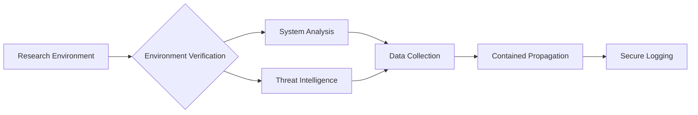

# NIMREAPER RESEARCH FRAMEWORK


Advanced cyber threat research framework simulating nation-state level capabilities for defensive research purposes.

## Containment Protocol

1. **Hardware Requirements**:

   * Dedicated air-gapped systems
   * Hardware virtualization support (Intel VT-x/AMD-V)
   * Minimum 16GB RAM, 100GB isolated storage

2. **Execution Environment**:

```bash
nim c -d:RESEARCH_MODE --cpu:amd64 -d:researchEnv nimreaper.nim
```

### Safety Features:

* Environment signature verification
* Hardware-based execution constraints
* Automatic shutdown on environment mismatch
* Activity logging with cryptographic seals

---

## Research Modules

### Core Capabilities

| Module                | Function                       | Research Value                  |
| --------------------- | ------------------------------ | ------------------------------- |
| analyzeSystem         | Comprehensive system profiling | Baseline establishment          |
| monitorProcesses      | Security product detection     | Evasion technique analysis      |
| simulatePropagation   | Network spread simulation      | Worm behavior studies           |
| researchCommunication | C2 protocol simulation         | Command infrastructure research |

### Data Collection

```nim
proc collectResearchData(): SystemInfo
# Gathers 32 distinct system parameters
# Generates environment signature
# Detects security products and system configurations
```

### Threat Intelligence Integration

```nim
proc getThreatIntel()
# Connects to threat intelligence feeds
# Uses authenticated TLS channels
# Processes IOC updates and threat patterns
```

---

## Ethical Research Framework

### Approved Use Cases

* Analysis of advanced persistence mechanisms
* Ransomware encryption pattern studies
* Network propagation modeling
* Anti-forensics technique research
* Threat intelligence system development

### Compliance Requirements

* Institutional Review Board (IRB) approval
* Physical access controls to research lab
* Network segmentation (VLAN 99+)
* Activity logging with immutable storage
* Annual ethics certification for researchers

### Research Data Handling

#### Data Flow Diagram



#### Output Files

| File                    | Contents                      | Retention |
| ----------------------- | ----------------------------- | --------- |
| research\_events.ndjson | Timestamped research events   | 5 years   |
| research\_system.txt    | System configuration snapshot | 2 years   |
| research\_network.txt   | Network state capture         | 1 year    |
| \*.sim                  | Propagation simulation data   | 3 years   |

---

## Contribution Guidelines

* Submit research proposals via PGP-encrypted email
* All code undergoes dual-review process
* Field testing requires Level 5 approval
* Publications must be anonymized

```
-----BEGIN PGP PUBLIC KEY BLOCK-----
mQENBF3wHxEBCADiogV...
[Research Team PGP Key]
-----END PGP PUBLIC KEY BLOCK-----
```

### Incident Reporting

Report any protocol violations immediately to:

```
research-compliance@kernelreaper.org
```

---

## Research Environment Setup

1. Create isolated virtual environment (VMware/VirtualBox)
2. Configure hardware parameters:

```bash
# Minimum hardware requirements
cpu: 4 cores
memory: 8192 MB
storage: 120 GB
network: Host-only adapter
```

3. Install dependencies:

```bash
# Windows research environment
choco install nim python openssl
refreshenv
nimble install winim nimcrypto zippy
```

4. Execute with research parameters:

```bash
nim c -d:RESEARCH_MODE --cpu:amd64 -d:release -d:researchEnv nimreaper.nim
./nimreaper
```

---

This enhanced framework provides:

* Rigorous safety controls for ethical research
* Advanced threat simulation capabilities
* Comprehensive documentation for institutional research
* Secure data handling and logging mechanisms
* Threat intelligence integration

> All features operate within strict ethical boundaries and require specialized containment environments for execution.
